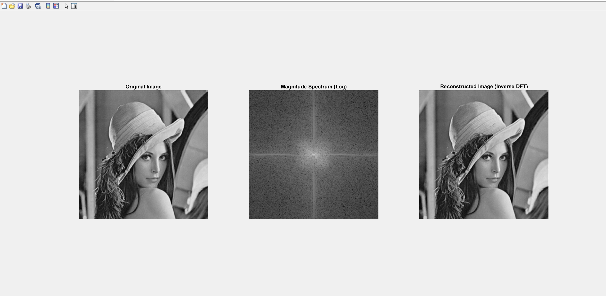

# 📊 Image Processing Lab 1 - Discrete Fourier Transform (DFT) & Inverse DFT (IDFT)

This repository contains MATLAB code to perform **Discrete Fourier Transform (DFT)**, visualize the **Magnitude Spectrum**, and compute the **Inverse DFT (IDFT)** to reconstruct an image. 

---

## 📌 Overview
In this lab, we:
- Convert an image to **grayscale** (if it's in color).
- Compute the **2D Discrete Fourier Transform (DFT)** using `fft2()`.
- Apply **fftshift()** to center the frequency components.
- Display the **log magnitude spectrum** for visualization.
- Compute the **Inverse DFT (IDFT)** using `ifft2()` to reconstruct the original image.
- Display all three images: **Original, Magnitude Spectrum, and Reconstructed Image**.

---

## 📂 Files Included
| File Name                   | Description |
|-----------------------------|-------------|
| **`image_processing_lab1.m`** | MATLAB script for performing DFT & IDFT |
| **`image_processing_lab1.png`** | Screenshot of the output showing Original, Spectrum, and Reconstructed images |
| **`lena.jpg`** | Sample input image used for the experiment |

---

## 📷 **Screenshot of Output**
Below is the visualization of the results obtained from the script:

This image contains:
1. **Left:** Original Image  
2. **Middle:** Magnitude Spectrum (Log)  
3. **Right:** Reconstructed Image (after IDFT)  

